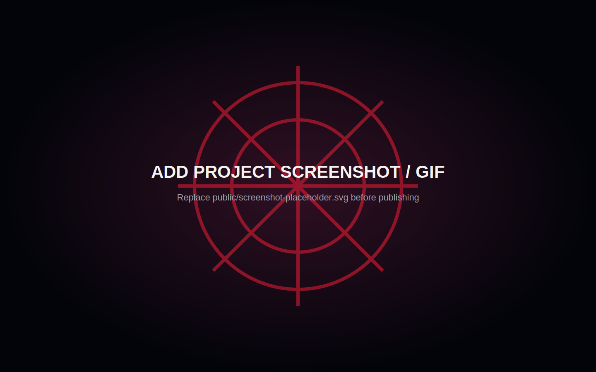

# Spider-Verse Developer

An original interactive landing page created as a technical concept for the **SPIDER-MAN: Brand New Day × InfoJobs developer challenge**. The experience combines a procedural night-time city, raycast web shooting, animated camera controls and a responsive mission dossier — without React, downloaded 3D models, textures or image-heavy backgrounds.

> This is an independent portfolio concept. It is not affiliated with or endorsed by Marvel, Sony Pictures, InfoJobs or any rights holder.



Replace the image above with a real project screenshot or GIF before publishing the repository.

## Highlights

- Procedural, seeded skyline built from instanced Three.js geometry.
- Organic web shots using raycasting and `CatmullRomCurve3`.
- Animated impact rings, secondary filaments and subtle camera feedback.
- Spider-Sense visual mode with environmental desaturation, waves and red light.
- OrbitControls with damping, safe distance limits, optional auto-rotation and a GSAP reset.
- Performance, Balanced and Cinematic presets that change scene density, pixel ratio, shadows and effects.
- Real-time FPS, object, web and scene-state monitor.
- Keyboard, mouse, touch and reduced-motion support.
- Synthesized opt-in sound using the Web Audio API; no audio files are required.
- A real loader tied to procedural scene preparation through `THREE.LoadingManager`.

## Technology

- Semantic HTML5
- Modern CSS with fluid type, container-safe spacing and responsive breakpoints
- Modular JavaScript (ES modules)
- [Three.js](https://threejs.org/) and OrbitControls
- [GSAP](https://gsap.com/)
- Vite

No React, Vue, Angular, jQuery, external models, stock imagery or remote fonts are used.

## Getting started

Requirements: Node.js 20.19 or newer.

```bash
npm install
npm run dev
```

Vite prints the local address. Open it in a WebGL-capable browser.

### Available commands

```bash
npm run dev      # development server
npm run build    # optimized production site in dist/
npm run preview  # preview the production client locally
npm test         # production build and portability smoke test
```

## Interactions

| Input | Action |
| --- | --- |
| Click / tap | Shoot a web at the selected world-space point |
| `W` | Shoot a web at a random point |
| `S` | Activate or deactivate Spider-Sense |
| `O` | Toggle automatic camera orbit |
| `R` | Restore the camera |
| `←` / `→` | Rotate left or right |
| `Space` | Small camera impulse |
| `Esc` | Close open panels and effects |
| Pointer drag | Orbit the camera |
| Pointer wheel / pinch | Zoom within safe limits |

## Personalize before publishing

Search for the bracketed placeholders in `index.html` and replace:

- `[GITHUB URL]`
- `[LINKEDIN URL]`
- `[EMAIL ADDRESS]`

The main GitHub CTA detects the repository automatically when the project runs on GitHub Pages. The contact button intentionally shows an editing reminder until a real email is added.

For a click-by-click upload guide, read [`UPLOAD_TO_GITHUB.md`](./UPLOAD_TO_GITHUB.md).

## Architecture

```text
spider-verse-developer/
├── index.html
├── package.json
├── vite.config.js
├── .github/workflows/
│   └── deploy-pages.yml
├── public/
│   ├── favicon.svg
│   ├── icons/
│   ├── models/
│   ├── sounds/
│   └── textures/
└── src/
    ├── main.js
    ├── styles.css
    ├── scene/
    │   ├── createScene.js
    │   ├── createCity.js
    │   ├── createLighting.js
    │   └── createParticles.js
    ├── interactions/
    │   ├── webShooter.js
    │   ├── spiderSense.js
    │   ├── keyboardControls.js
    │   └── cameraControls.js
    ├── ui/
    │   ├── loader.js
    │   ├── notifications.js
    │   ├── missionPanel.js
    │   ├── qualitySelector.js
    │   └── panel.css
    └── utils/
        ├── performance.js
        ├── dispose.js
        ├── responsive.js
        └── sound.js
```

## Performance decisions

- `InstancedMesh` renders repeated buildings and window panes with fewer draw calls.
- One seeded city generation pass gives a stable composition without loading a model.
- Temporary web geometries are capped, time-limited and explicitly disposed.
- Reusable web and impact materials avoid per-frame allocation.
- Pixel ratio is capped per quality mode.
- Particle counts, city density, shadows and filament counts change with the selected preset.
- The animation loop pauses while the tab is hidden.
- Resize work is debounced.
- Secondary interface modules are dynamically imported after the core scene is ready.
- No materials, geometries or DOM nodes are created inside the render loop.

The largest production chunk contains Three.js and GSAP. Its compressed size is substantially smaller than its uncompressed module size; no model or texture payload is added on top.

## Accessibility

- Semantic headings, regions, buttons and definition lists.
- Visible keyboard focus states and a skip link.
- Dialog focus management and a simple focus loop.
- `prefers-reduced-motion` support plus an in-page motion toggle.
- Reduced flashes and camera movement in reduced-motion mode.
- High-contrast text and large mobile touch targets.
- A readable WebGL fallback.

## Adding licensed assets later

The current version is fully procedural and needs no third-party media. If you add media:

1. Put models in `public/models`, textures in `public/textures` and sound effects in `public/sounds`.
2. Load models through `GLTFLoader` and the shared `LoadingManager`.
3. Prefer compressed GLB/Draco and modern WebP/AVIF textures.
4. Record the author, source URL, exact license and any required attribution in this README.
5. Do not add assets whose reuse rights cannot be verified.

## Deployment

### GitHub Pages

The Vite base is relative, so project pages work from a repository subdirectory.

1. Upload the repository files to the `main` branch.
2. In **Settings → Pages**, choose **GitHub Actions** as the source.
3. The included workflow installs, builds and deploys `dist` automatically after each push.

### Netlify

- Build command: `npm run build`
- Publish directory: `dist`

### Vercel

- Framework preset: Vite
- Build command: `npm run build`
- Output directory: `dist`

## Credits and licenses

- Three.js: MIT License.
- GSAP core: used under GreenSock's standard license terms; review the current terms for your deployment context.
- All visible city geometry, windows, particles, webs, emblem shapes, UI graphics and Web Audio effects in this repository are original procedural/code-based work created for this project.
- Spider-Man-related names are used only to identify the theme and challenge context; associated trademarks and characters belong to their respective owners.

## Browser support

Recent versions of Chrome, Edge, Firefox and Safari with WebGL enabled. On low-power or mobile devices, the app starts with the Performance preset automatically.
